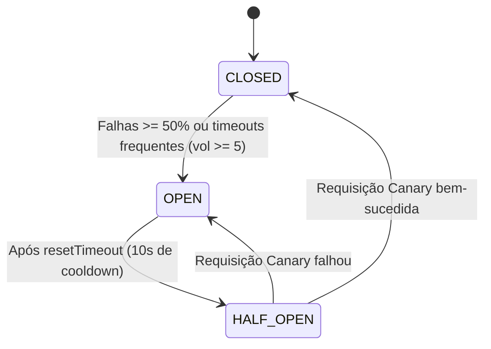

# Data Model: API Gateway, Circuit Breaker e Rate Limiting

**Feature**: `003-api-gateway-resilience`  
**Date**: 2026-10-01  
**Status**: Concluído  

---

## Entidades e Modelos Estruturais

O padrão API Gateway atua como camada de orquestração, proteção e proxy de rede. Suas entidades e estruturas representam o ciclo de vida da requisição, as políticas de limitação de taxa e o estado dos circuitos de proteção.

---

### 1. `GatewayRequest`

Representa a requisição pública capturada pelo Route Handler do Gateway antes do encaminhamento downstream.

| Campo | Tipo | Descrição | Regras de Validação |
|---|---|---|---|
| `method` | `'GET' \| 'POST' \| 'PUT' \| 'DELETE'` | Método HTTP da requisição | Deve pertencer aos métodos permitidos |
| `targetPath` | `string` | Caminho do recurso de destino (ex.: `unburden`, `comment`, `support`) | Não pode ser vazio; deve mapear para um recurso válido |
| `clientIp` | `string` | Endereço IP do cliente originador | Extraído com segurança de headers ou conexão |
| `headers` | `Record<string, string>` | Cabeçalhos HTTP repassados | Cabeçalhos internos de segurança são higienizados |
| `queryParams` | `Record<string, string>` | Parâmetros de busca da URL | Sanitizados e repassados |
| `body` | `unknown` | Corpo da requisição (quando aplicável) | Validado posteriormente pelo schema Zod do recurso |

---

### 2. `RateLimitConfig` & `RateLimitBucket`

Controla a cota de tráfego por cliente/IP em uma janela deslizante de tempo.

#### `RateLimitConfig`
| Campo | Tipo | Descrição |
|---|---|---|
| `windowMs` | `number` | Duração da janela temporal em milissegundos (padrão: 60.000ms = 1 min) |
| `maxRequests` | `number` | Número máximo de requisições permitidas na janela |

#### `RateLimitBucket`
| Campo | Tipo | Descrição |
|---|---|---|
| `key` | `string` | Identificador único (`${clientIp}:${policyType}`) |
| `count` | `number` | Quantidade de requisições consumidas na janela corrente |
| `expiresAt` | `number` | Timestamp em milissegundos do fim da janela ativa |

#### `RateLimitResult`
| Campo | Tipo | Descrição |
|---|---|---|
| `allowed` | `boolean` | `true` se a requisição está dentro do limite; `false` se foi bloqueada |
| `limit` | `number` | Teto total da política aplicada |
| `remaining` | `number` | Requisições remanescentes na janela |
| `retryAfterSeconds` | `number` | Segundos necessários aguardar até a liberação de nova cota |
| `resetAt` | `number` | Timestamp em segundos do reset da janela |

---

### 3. `CircuitBreakerConfig` & `CircuitBreakerState`

Gerencia a proteção contra falhas em cascata e degradação de serviços downstream.

#### Estados do Circuito (`CircuitBreakerState`)
```typescript
type CircuitBreakerState = "CLOSED" | "OPEN" | "HALF_OPEN";
```

- **`CLOSED`**: Operação normal. Todas as requisições fluem para os serviços downstream. Se a taxa de erro ultrapassar `errorThresholdPercentage`, comuta para `OPEN`.
- **`OPEN`**: Circuito desarmado/aberto. Todas as requisições falham imediatamente (*fail-fast*) com HTTP `503 Service Unavailable`, sem acionar downstream.
- **`HALF_OPEN`**: Período de teste após `resetTimeout`. Uma requisição canary é liberada. Se obtiver sucesso, retorna para `CLOSED`; se falhar, retorna para `OPEN`.

#### `CircuitBreakerConfig`
| Campo | Tipo | Valor Padrão | Descrição |
|---|---|---|---|
| `timeout` | `number` | `5000` (ms) | Tempo limite antes de considerar a requisição downstream abortada |
| `errorThresholdPercentage` | `number` | `50` (%) | Percentual mínimo de falhas para abertura do circuito |
| `resetTimeout` | `number` | `10000` (ms) | Tempo de espera em estado `OPEN` antes de tentar `HALF_OPEN` |
| `volumeThreshold` | `number` | `5` | Mínimo de chamadas dentro da janela estatística para autorizar abertura |

---

### 4. `GatewayResponse`

Contrato padronizado de saída emitido pelo Gateway ao cliente externo.

| Campo | Tipo | Descrição |
|---|---|---|
| `status` | `number` | Código de status HTTP (200, 201, 400, 401, 404, 429, 500, 503) |
| `headers` | `Record<string, string>` | Cabeçalhos de resposta sanitizados (sem `X-Powered-By`, com rate limit headers) |
| `body` | `unknown` | Payload de retorno do serviço ou mensagem de erro padronizada |

---

### 5. Diagrama de Transição de Estados do Circuit Breaker


