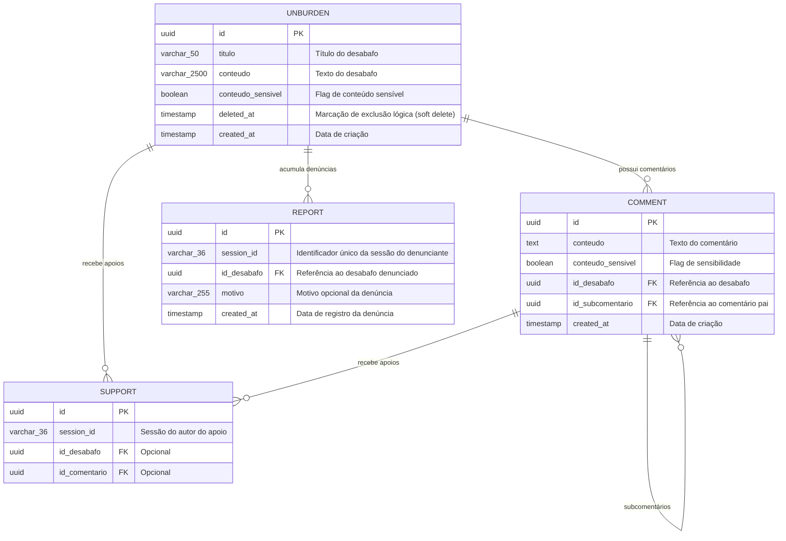
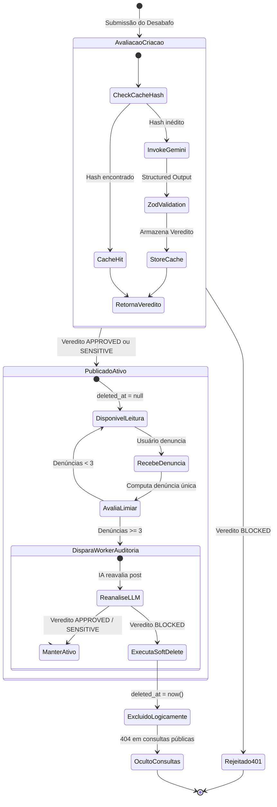

# Data Model: Curadoria de Conteúdo com IA, Caching Hash e Denúncias

**Feature**: `004-llm-curation-moderation`  
**Date**: 2026-10-01  
**Status**: Concluído  

---

## 1. Diagrama Entidade-Relacionamento



---

## 2. Especificação das Entidades

### Entidade: `Unburden` (`desabafo`)
Representa a publicação central criada pelos usuários.

| Campo | Tipo | Nulo | Padrão | Descrição |
| :--- | :--- | :---: | :--- | :--- |
| `id` | UUID | Não | `uuid()` | Identificador único do desabafo |
| `title` (`titulo`) | VarChar(50) | Não | - | Título curto do desabafo |
| `content` (`conteudo`) | VarChar(2500) | Não | - | Corpo textual do desabafo |
| `sensitiveContent` (`conteudo_sensivel`) | Boolean | Sim | `false` | Indica se o conteúdo exige aviso de gatilho/sensibilidade |
| `deletedAt` (`deleted_at`) | Timestamp | Sim | `null` | Data/hora de exclusão lógica por auditoria de moderação |
| `createdAt` (`created_at`) | Timestamp | Não | `now()` | Data/hora de publicação |

#### Regras de Negócio e Validação
- Se `deletedAt` for diferente de `null`, o desabafo é considerado **excluído logicamente** e deve ser ignorado em consultas públicas (`findMany`, `findUnique`).
- Durante a criação, se a IA categorizar o desabafo como `BLOCKED`, a entidade **não é persistida** no banco de dados e retorna `401 Unauthorized`.
- Se a IA categorizar como `SENSITIVE`, `sensitiveContent` é persistido como `true`.

---

### Entidade: `Report` (`denuncia`)
Representa a sinalização de um desabafo feita por um membro da comunidade.

| Campo | Tipo | Nulo | Padrão | Descrição |
| :--- | :--- | :---: | :--- | :--- |
| `id` | UUID | Não | `uuid()` | Identificador único da denúncia |
| `sessionId` (`session_id`) | VarChar(36) | Não | - | Identificador de sessão do denunciante |
| `unburdenId` (`id_desabafo`) | UUID | Não | - | Chave estrangeira para o desabafo denunciado |
| `reason` (`motivo`) | VarChar(255) | Sim | `null` | Motivo opcional da denúncia |
| `createdAt` (`created_at`) | Timestamp | Não | `now()` | Data e hora do registro da denúncia |

#### Regras de Negócio e Restrições
- **Constraint de Unicidade**: `@@unique([sessionId, unburdenId])` garante que a mesma sessão só pode denunciar um mesmo desabafo uma única vez (idempotência).
- **Integridade Referencial**: `onDelete: Cascade` ou `onDelete: Restrict` associado à chave estrangeira `unburdenId`.

---

### Entidade de Domínio em Memória: `ModerationVerdict`
Representa o resultado imutável da avaliação por Inteligência Artificial.

```typescript
export interface ModerationVerdict {
  status: "APPROVED" | "SENSITIVE" | "BLOCKED";
  category:
    | "safe"
    | "self_harm_distress"
    | "apology_violence"
    | "sexual_violence"
    | "hate_speech"
    | "illegal";
  isSensitive: boolean;
  reason?: string;
  contentHash: string;
  evaluatedAt: number;
}
```

---

## 3. Ciclo de Vida e Transições de Estado


